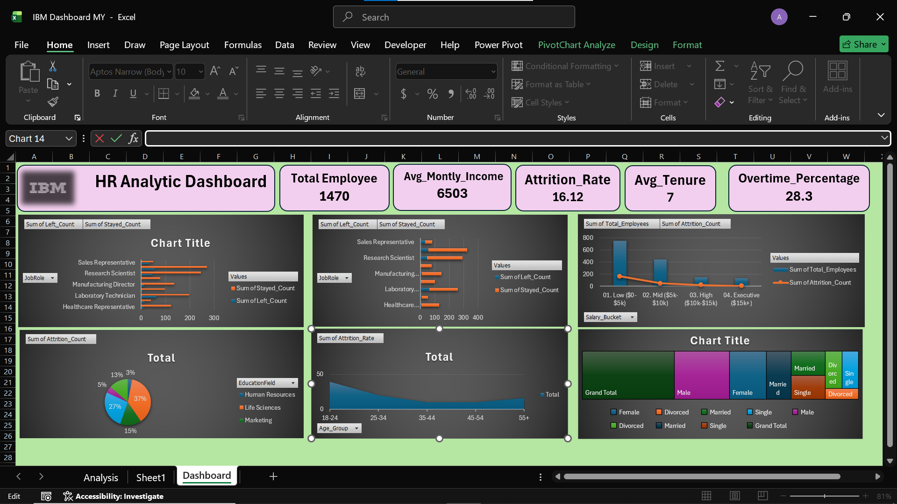

# 📊 IBM HR Analytics Dashboard

## 🚀 Project Overview
The IBM HR Analytics Dashboard is an interactive business intelligence project developed in Microsoft Excel to analyze employee attrition, workforce demographics, salary distribution, overtime trends, and employee behavior.

This dashboard helps HR teams and business stakeholders monitor workforce performance, identify attrition patterns, and make data-driven HR decisions using interactive visualizations and KPI tracking.

---

# 🎯 Business Objectives

- Analyze employee attrition trends
- Monitor workforce demographics
- Track salary and income distribution
- Evaluate overtime impact on attrition
- Understand employee distribution by job role and age group
- Improve HR decision-making through interactive analytics

---

# 🛠️ Tools & Technologies Used

| Tool | Purpose |
|------|----------|
| Microsoft Excel | Dashboard Development |
| Pivot Tables | Data Aggregation |
| Pivot Charts | Data Visualization |
| KPI Cards | Key Metrics Tracking |
| Conditional Formatting | Data Highlighting |
| Slicers | Interactive Filtering |

---

# 📌 Dashboard Features

## 📈 KPI Cards

The dashboard includes dynamic KPI indicators for:

- Total Employees
- Average Monthly Income
- Attrition Rate
- Average Tenure
- Overtime Percentage

---

# 📊 Visualizations Included

## 1️⃣ Employee Attrition Analysis
- Attrition comparison across job roles
- Employee stayed vs left analysis
- Identifies high attrition job categories

---

## 2️⃣ Salary Distribution Analysis
- Employee salary bucket comparison
- Attrition impact by income group
- Helps understand compensation trends

---

## 3️⃣ Education Field Analysis
- Attrition analysis by education background
- Comparison across Life Sciences, HR, Marketing, etc.
- Supports workforce planning

---

## 4️⃣ Age Group Attrition Trend
- Attrition rate analysis across age groups
- Identifies high-risk employee segments
- Helps HR retention planning

---

## 5️⃣ Marital Status & Gender Distribution
- Employee demographic analysis
- Distribution by marital status and gender
- Supports diversity insights

---

# 🎛️ Interactive Dashboard Features

Users can dynamically filter dashboard data using slicers and pivot interactions for detailed drill-down analysis.

Interactive elements improve dashboard usability and reporting efficiency.

---

# 📷 Dashboard Preview

---

# 📂 Project Files

- 📄 IBM Dashboard MY.xlsx
- 🖼️ Hr.png
- 📘 README.md

---

# 🔍 Key Business Insights

- Certain job roles experienced higher attrition rates
- Employees with overtime showed increased attrition trends
- Lower salary groups had comparatively higher employee turnover
- Attrition varied significantly across education fields
- Younger employee groups showed relatively higher attrition

---

# 💡 Skills Demonstrated

- HR Data Analysis
- Excel Dashboard Development
- Business Intelligence
- KPI Reporting
- Data Visualization
- Workforce Analytics
- Interactive Reporting
- Analytical Thinking

---

# 📚 Learning Outcome

Through this project, I improved my understanding of:

- HR Analytics
- Employee Attrition Analysis
- Workforce KPI Tracking
- Interactive Dashboard Designing
- Business Data Storytelling

---

# 👨‍💻 Author

ABDUSSAMI SAYYED

📧 Email: abdussamisayyed@gmail.com  
🔗 GitHub: https://github.com/abdussamisayyed-analyst

---

# ⭐ If you found this project useful, give it a star on GitHub!
